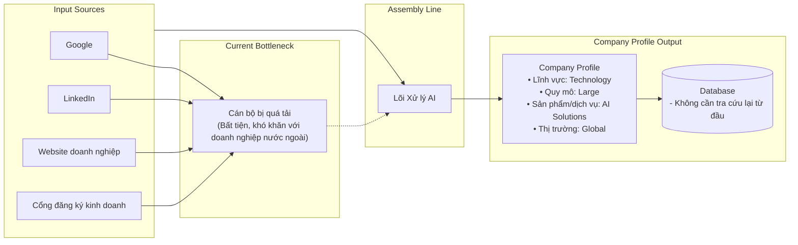

# Documentation: Automated Customer Enterprise Profile Creation

## 1. Overview

This documentation outlines the automated assembly line for creating enterprise customer profiles, designed to replace manual, inefficient data collection processes.

## 2. Problem Statement

The current methodology for building enterprise profiles relies on manual data gathering from fragmented sources (Google, LinkedIn, business websites, and registration portals). This approach results in:

* **Operational Bottlenecks:** Human officers are overwhelmed by the volume and complexity of data.

* **Inefficiency:** High time cost and significant inconvenience, particularly when dealing with foreign enterprises.

## 3. The Proposed Solution: Automated Assembly Line

The proposed solution implements an AI-driven "Assembly Line" that ingests raw data from multiple sources and converts it into structured, actionable intelligence.

### 3.1 Workflow Architecture

The system integrates various input sources into a centralized AI processing core, which then populates a structured database.

• Lĩnh vực: Technology -> What the are doig ? Domain ? Business
• Quy mô: Large -> The scale of this company ? How many employees ? 
• Sản phẩm/dịch vụ: AI Solutions -> What they provides as services ? 
• Thị trường: Global"] -> Global ? Localize ? Where are they operate

## 4. Key Benefits

* **Automated Data Processing:** The "Lõi Xử lý AI" (AI Processing Core) handles data aggregation, reducing the need for manual intervention.

* **Standardized Output:** Generates comprehensive profiles including technology field, company scale, product/service offerings, and market reach.

* **Persistent Data Storage:** By storing information in a structured database, the system eliminates the need to perform redundant research for future requests, drastically reducing turnaround time.